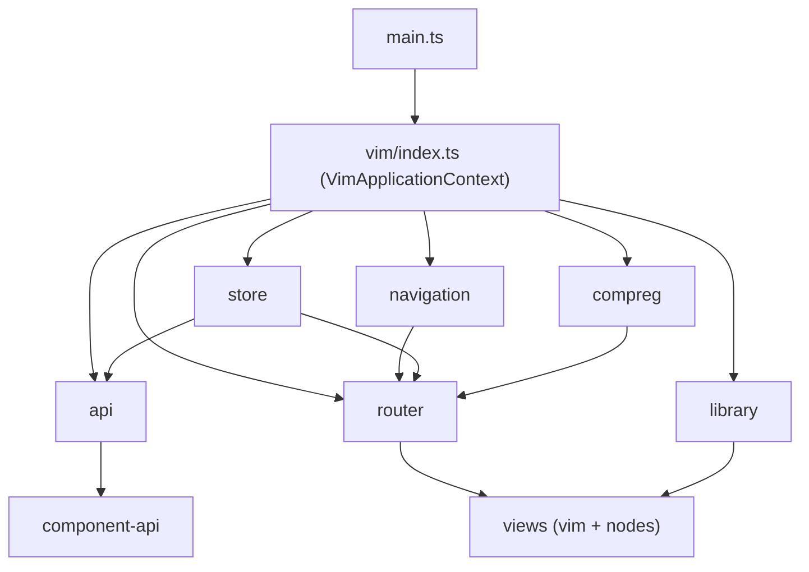
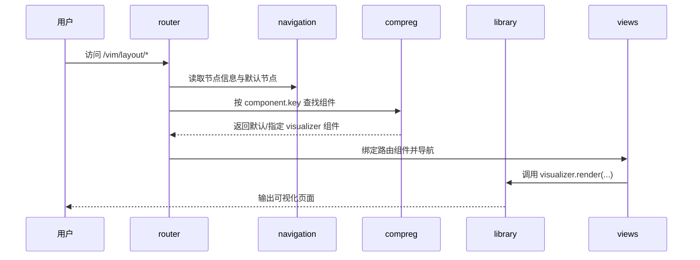
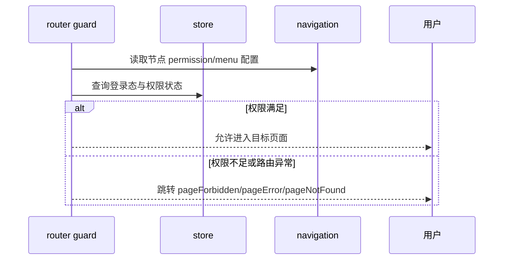

# VIM Architecture - 总体架构说明

本文描述 **VIM（Vue Interactive Model）** 在 `webapp-pc`、`webapp-mobile` 中的分层与协作关系，
建立 `vim -> api/compreg/library/navigation/router/store/views` 的统一认知。
更一般的 monorepo 导读与构建编排见 [Familyhelper UI View - 前端 view 模块导读](./FamilyhelperUiView.md)、
[VIM 5 构建脚本与 build.js](./FamilyhelperUiViewBuildScript.md)； 安装与命令行约定仍以 `familyhelper-ui-view` 内 `README.md` 为准。

## 适用范围

- 适用模块：`webapp-pc`、`webapp-mobile`。
- 不覆盖内容：部署运维、Tomcat 配置。
- 本文聚焦浏览器侧 VIM 架构，不替代模块内 `README.md` 的环境与命令细节。

## 总体架构图

### 逻辑分层

说明：

- `vim` 负责创建并维护 `VimApplicationContext`，统一收口各核心模块。
- `router` 不直接硬编码业务页面组件，而是结合 `navigation` 与 `compreg` 的数据动态装配路由。
- `views` 分为 `views/vim`（框架视图）与 `views/nodes`（业务视图）；渲染方式由 `library` 提供的 Visualizer 能力驱动。

### 启动链路

`webapp-pc` 与 `webapp-mobile` 使用一致入口模式，启动顺序可归纳为：

1. `main.ts` 调用 `vim.init()`，完成 VIM 上下文与核心模块初始化。
2. `vim/index.ts` 创建 Vue `app`，设置 `VimApplicationContext`。
3. 依次初始化 `api`、`library`、`compreg`、`navigation`、`router`、`store`。
4. 统一等待异步初始化完成后，将 VIM 状态切换为 `initialized`。
5. 执行 VIM 初始化钩子、注册 window 生命周期钩子。
6. 回到 `main.ts`，执行 `vim.ctx().app.mount('#app')` 渲染首屏。

约束：

- 初始化阶段禁止提前访问 `ctx()` 或各模块对外能力，相关模块均有 `initializing` 状态保护。
- 各模块可注册初始化/窗口钩子，但应保持幂等与顺序可控，避免在热更新和重复初始化场景产生副作用。

## 核心模块职责

### vim

| 项      | 说明                                                      |
|--------|---------------------------------------------------------|
| 输入     | Vue `App`、各模块实现、初始化/窗口钩子注册请求                            |
| 输出     | `VimApplicationContext`、统一的模块访问入口、初始化生命周期               |
| 依赖     | `api`、`compreg`、`library`、`navigation`、`router`、`store` |
| 典型使用场景 | 在业务代码中通过 `vim.ctx()` 获取模块能力；在模块初始化时注册生命周期钩子             |

### api

| 项      | 说明                                                          |
|--------|-------------------------------------------------------------|
| 输入     | 环境配置（`development/debug/production`）、认证 token、`props.ts` 配置 |
| 输出     | `generalClient`、`publicClient`、统一 `baseUrl`                 |
| 依赖     | `component-api`、`store`（用于读取登录态 token）                      |
| 典型使用场景 | 通过 `component-api` 暴露的接口方法发起请求，或在特殊场景中使用公共客户端               |

### navigation

| 项      | 说明                                     |
|--------|----------------------------------------|
| 输入     | `modules/*.ts` 导航节点定义（`NodeSetting`）   |
| 输出     | 节点树（根节点、子节点、显示/权限/路由信息）                |
| 依赖     | `component-util`（命名转换等工具）、`store`（消费侧） |
| 典型使用场景 | 声明菜单、节点排序、节点级权限与路由元信息                  |

### router

| 项      | 说明                                                        |
|--------|-----------------------------------------------------------|
| 输入     | 基础静态路由、`navigation` 节点信息、`compreg` 组件信息、`store` 状态        |
| 输出     | Vue Router 实例、动态 `vim.layout` 子路由、守卫拦截结果                  |
| 依赖     | `vue-router`、`navigation`、`compreg`、`store`、`views/vim/*` |
| 典型使用场景 | 登录后跳转、按导航节点生成业务页面路由、权限失败跳转错误页                             |

### store

| 项      | 说明                                       |
|--------|------------------------------------------|
| 输入     | `modules/*.ts` Store 模块定义、初始化上下文         |
| 输出     | Pinia StoreDefinition 与 Store 实例访问入口     |
| 依赖     | `pinia`、各业务 store 模块                     |
| 典型使用场景 | 读取登录态、页面状态、可视化器状态；通过 `$onAction` 组织跨模块协作 |

### compreg

| 项      | 说明                                        |
|--------|-------------------------------------------|
| 输入     | `modules/*.ts` 组件注册定义（`ComponentSetting`） |
| 输出     | `componentInfo(key)`、默认组件信息、可视化器维度组件映射    |
| 依赖     | `component-util`（命名转换等工具）                 |
| 典型使用场景 | 路由根据组件 key 查找实际页面组件，实现“导航配置驱动组件解析”        |

### library

| 项      | 说明                                             |
|--------|------------------------------------------------|
| 输入     | `modules/*/index.ts` 的 Visualizer 定义与第三方库初始化逻辑 |
| 输出     | 默认/指定 Visualizer 信息、统一 `notify/render` 能力      |
| 依赖     | 第三方组件库、样式资源、Vue 渲染函数能力                         |
| 典型使用场景 | 提供 `layout/login/pageError/...` 等框架渲染与通知实现     |

### views

| 项      | 说明                                                                    |
|--------|-----------------------------------------------------------------------|
| 输入     | 路由元数据、`library` 的 Visualizer 能力、`store` 状态                            |
| 输出     | 实际页面渲染结果                                                              |
| 依赖     | `views/vim`（框架视图）与 `views/nodes`（业务视图）                                |
| 典型使用场景 | `views/vim/layout/Layout.vue` 在 ready 前显示遮罩，ready 后委托 Visualizer 渲染布局 |

## 模块协作时序

### 页面进入与组件解析

### 权限校验与菜单可见性

补充说明：

- 菜单“可见性”与路由“可访问性”需要同时满足；仅显示菜单不等于可放行路由。
- 当 `navigation`、`visualizer` 等关键数据变化时，`router` 会刷新 `vim.layout` 路由映射，保证页面解析与当前配置一致。

## 扩展点与约束

允许扩展点：

- 在 `navigation/modules` 新增导航模块，扩展节点树与菜单结构。
- 在 `compreg/modules` 新增组件注册模块，扩展页面组件映射。
- 在 `library/modules` 新增或替换 Visualizer，实现不同组件库风格。
- 在 `store/modules` 新增 Store 模块，通过标准接口参与全局状态。

禁止修改点（无明确需求时）：

- 不建议直接改动 `router` 核心守卫与基础路由初始化逻辑。
- 不建议绕过 `vim` 上下文直接拼装模块依赖，避免生命周期失配。
- 不建议在业务页面直接硬编码跨模块耦合逻辑，优先经 `ctx()` 与模块 API 协作。

兼容性要求：

- 继续保持 `webapp-pc`、`webapp-mobile` 的 VIM 启动与模块边界一致。
- 新增模块应遵循动态扫描约定（命名、默认导出、接口签名）。
- `compreg` 与 `navigation` 的 key 约定应保持一致，避免路由解析失败。
- 以 `component-api` 作为后端接口访问主入口，避免散落式 HTTP 实现。

## 常见误区

- 在初始化阶段直接访问 `vim.ctx()`：仅在 VIM 初始化完成后访问上下文；初始化过程中的依赖通过 `init(ctx)` 传入。
- 把菜单可见性等同于权限放行：同时校验节点 `menu` 与 `permission` 语义，并以路由守卫结果为准。
- `compreg` 组件映射未提供默认项：保证存在兜底组件与默认 key，避免 visualizer 切换后出现空组件。
- 修改 `views/vim` 时忽略 Visualizer 协议：保持 `render(type, h)` 对应关系稳定，框架视图只做转发与状态控制。
- 在 `webapp-pc`、`webapp-mobile` 之间引入非必要差异：优先保持相同架构约束，仅在业务差异处局部扩展。

## 参阅

- [Familyhelper UI View](./FamilyhelperUiView.md) - 前端 view 模块（monorepo）导读，说明模块定位、包划分与后续文档阅读顺序，细节请参阅该目录内 `README.md`。
- [Familyhelper UI View Build Script](./FamilyhelperUiViewBuildScript.md) - VIM 5 构型下 `scripts/build.js`的原理，
  含 workspace 依赖图、并行调度及与 Vue 官方 `scripts/build.js` 的差异说明。
